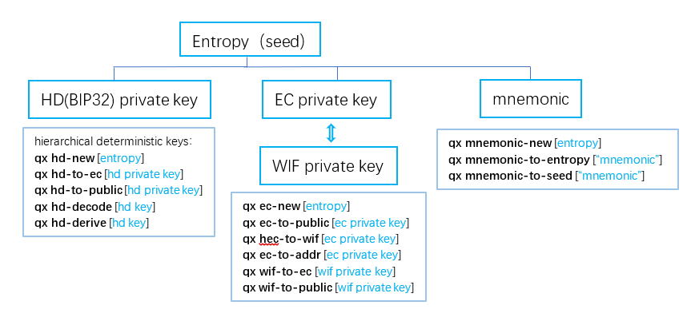

## get an address using qx

use qx command in cmd command window (在cmd命令窗口使用qx命令，不要在git中使用，否则会出现没有权限的情况)

### qx --help

```
D:\git\qx>qx
Usage: qx [--version] [--help] <command> [<args>]

encode and decode :
    base58-encode         encode a base16 string to a base58 string
    base58-decode         decode a base58 string to a base16 string
    base58check-encode    encode a base58check string
    base58check-decode    decode a base58check string
    base64-encode         encode a base16 string to a base64 string
    base64-decode         encode a base64 string to a base16 string
    rlp-encode            encode a string to a rlp encoded base16 string
    rlp-decode            decode a rlp base16 string to a human-readble representation

hash :
    blake2b256            calculate Blake2b 256 hash of a base16 data.
    blake2b512            calculate Blake2b 512 hash of a base16 data.
    sha256                calculate SHA256 hash of a base16 data.
    sha3-256              calculate SHA3 256 hash of a base16 data.
    keccak-256            calculate legacy keccak 256 hash of a bash16 data.
    blake256              calculate blake256 hash of a base16 data.
    ripemd160             calculate ripemd160 hash of a base16 data.
    bitcoin160            calculate ripemd160(sha256(data))
    hash160               calculate ripemd160(blake2b256(data))

entropy (seed) & mnemoic & hd & ec
    entropy               generate a cryptographically secure pseudorandom entropy (seed)
    hd-new                create a new HD(BIP32) private key from an entropy (seed)
    hd-to-ec              convert the HD (BIP32) format private/public key to a EC private/public key
    hd-to-public          derive the HD (BIP32) public key from a HD private key
    hd-decode             decode a HD (BIP32) private/public key serialization format
    hd-derive             Derive a child HD (BIP32) key from another HD public or private key.
    mnemonic-new          create a mnemonic world-list (BIP39) from an entropy
    mnemonic-to-entropy   return back to the entropy (the random seed) from a mnemonic world list (BIP39)
    mnemonic-to-seed      convert a mnemonic world-list (BIP39) to its 512 bits seed
    ec-new                create a new EC private key from an entropy (seed).
    ec-to-public          derive the EC public key from an EC private key (the compressed format by default )
    ec-to-wif             convert an EC private key to a WIF, associates with the compressed public key by default.
    wif-to-ec             convert a WIF private key to an EC private key.
    wif-to-public         derive the EC public key from a WIF private key.

addr & tx & sign
    ec-to-addr            convert an EC public key to a paymant address. default is qx address
    tx-encode             encode a unsigned transaction.
    tx-decode             decode a transaction in base16 to json format.
    tx-sign               sign a transactions using a private key.
    msg-sign              create a message signature
    msg-verify            validate a message signature
    signature-decode      decode a ECDSA signature
```


### get an addr using qx 

- generate an `entropy`(seed) 生成随机数种子

```
$ qx entropy
  2311a023b585290b46bb6c68fc4235a36ee7ea4a40fa71395b67aa461d91edb4
```

- create a new `EC private key` from an entropy (seed)

    ```
    $ qx ec-new 2311a023b585290b46bb6c68fc4235a36ee7ea4a40fa71395b67aa461d91edb4
      9b50981dc5cf4b4c530a8af109be6d07162141c4c45e5b1c2e6c0941138d3041
    ```

- create a `mnemonic` world-list (BIP39) from an entropy

    ```
    $ qx mnemonic-new 2311a023b585290b46bb6c68fc4235a36ee7ea4a40fa71395b67aa461d91edb4
      cart minimum angry help family mad brain horn happy tilt miracle egg unveil vivid cinnamon butter illness skull supreme fee gift similar replace often
    ```
  
  - `return back` to the entropy (the random seed) from a mnemonic world list (BIP39)
  
   ```bash
   $ qx mnemonic-to-entropy "cart minimum angry help family mad brain horn happy tilt miracle egg unveil vivid cinnamon butter illness skull supreme fee gift similar replace often"
    2311a023b585290b46bb6c68fc4235a36ee7ea4a40fa71395b67aa461d91edb4
   ```

   - convert a mnemonic world-list (BIP39) to its `512 bits seed`
   
   ```bash
  $ qx mnemonic-to-seed "cart minimum angry help family mad brain horn happy tilt miracle egg unveil vivid cinnamon butter illness skull supreme fee gift similar replace often"
   5d962a117ed0807b92e71862ad96aec9c69b7afe0c26b50136977941a3fbae1820b931a015d5e993f2adc765941af9767a24120710b5e7be3cafc76f846b37d4
   ```

- derive the `EC public key` from an EC private key (the compressed format by default，the uncompressed format add `-u` )

  ```bash
  $ qx ec-to-public 9b50981dc5cf4b4c530a8af109be6d07162141c4c45e5b1c2e6c0941138d3041
    0266f8dfd4798c204a06e96571e145ec525ac8809dbefa5025a7ed4666a9a8d0e2
  ```


- convert an `EC public key` to a paymant `address`. default is qx address

  ```bash
  $ qx ec-to-addr --help
   Usage: qx ec-to-addr [ec_public_key]
     -v version
           base58check version [mainnet|testnet|privnet] (default testnet)
  ```

  - get test-net address 
   ```bash
   $ qx ec-to-addr 0266f8dfd4798c204a06e96571e145ec525ac8809dbefa5025a7ed4666a9a8d0e2
     TmZ9V2Ex2raifSvUu6eBQBWsfn391t3hSS3
   ```
   
   - get main-net address
   ```bash
   $ qx ec-to-addr -v mainnet 0266f8dfd4798c204a06e96571e145ec525ac8809dbefa5025a7ed4666a9a8d0e2
     NmSTb6x3JwWcwoQxSTA2cZ7dSzLNuGkeVmn
   ```
   

- summary

   - Use `qx entropy` generate an `entropy`, then use `qx ec-new` create a new `EC private key` from an entropy (seed), you can create a `mnemonic` world-list (BIP39) from an entropy. 
   
   - Use `qx ec-to-public` can derive the `EC public key` from an `EC private key`. 
   
   - Then use `qx ec-to-addr` can convert an `EC public key` to a paymant `address`.

  利用随机数熵（种子）生成私钥和助记词，利用私钥生成公钥，利用公钥生成地址。


### Relationship Spectrum

- EC: Elliptic Curve 椭圆曲线
- HD(BIP32)：hierarchical deterministic keys，分层确定性私钥
- WIF: wallet import format, 钱包导入格式

- entropy：信息熵可以说是系统有序化程度的一个度量，对信息混乱程度的度量。在计算中，熵是由操作系统或应用程序收集的随机性，用于密码学或需要随机数据的其他用途。


 


